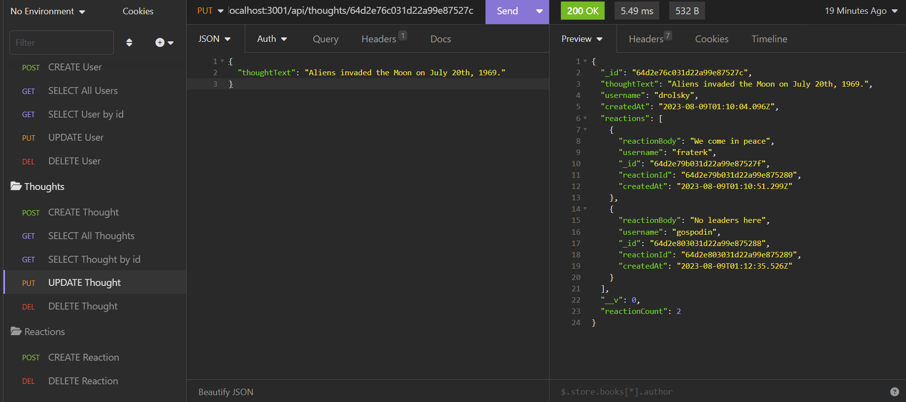

# Social_Network_API
Backend framework for social networking site

## Description

MongoDB/Mongoose backend for social networking site. Contains all basic API's and CRUD operations for manipulating users, thoughts, reactions, and friends.

## Usage

Application is run in Node.js and accessed via Insomnia or other API testing environment.

Interaction is via a combination of url parameters and JSON body requests.

Available API Routes:

All (use for GET and POST):  
api/users  
api/thoughts  

By ID (use for GET, PUT, DELETE):  
api/users/:userId  
api/thoughts/:thoughtId  

Relationships:  
api/users/:userId/friends/:friendId (for POST and DELETE)    
api/thoughts/:thoughtId/reactions (for POST)    
api/thoughts/:thoughtId/reactions/:reactionId (for DELETE)    

GitHub Repository can be found here:  
https://github.com/creechj/Social_Network_API

Demonstration video can be found here:    
https://drive.google.com/file/d/11avGfPNejTr-l-VxndJBkUqWE58662Nz/view?usp=sharing

## Credits

getter for createdAt date format:  
https://stackoverflow.com/questions/70724966/how-to-use-getter-or-setter-with-mongoose-timestamps

populate specification:  
https://www.youtube.com/watch?v=cu6VQgT3EEI

random thought generator:  
https://generatorfun.com/shower-thought-generator

random email generator:  
https://www.randomlists.com/

## License

Please see license in repository for this application